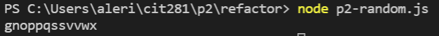

## Techniques Used 

- CLI commands
- Using CLI to commit files to github
- Using VSCode to commut files to github 
- Creating a .gitignore file
- Non-web server Node.js JavaScript code
    - Functions
    - Function expressions
    - for loops
    - .length property
    - .split() method 
    - .sort() method
    - .join() method
    - .fromCharCode() method
    - console.log() method

## Objectives


### Write functions which returns a string of 10-20 random letters from the English alphabet sorted in alphabetical order using non-server node.js javascript code. Commit to github using the terminal.

```
// Returns a random number between min (inclusive) and max (exclusive)
function getRandomInteger(min, max) {
    return Math.floor(Math.random() * (max - min) + min);
}

//returns a random letter from "alphabet"
function getRandomLetter(){
const alphabet = "abcdefghijklmnopqrstuvwxyz".split("");
return alphabet[getRandomInteger(1,alphabet.length-1)]
}


 //loop for a random # of intervals between min and max parameters, adding a random letter for each loop to "result"
function getRandomString(minLength, maxLength){
    let result = "";
    for (let i = 0; i < getRandomInteger(minLength, (maxLength + 1)); i++) {
        result += getRandomLetter();
    }
    return result
}
//returns a string sorted in ascending order by converting it to an array, sorting, then back to a string
function getSortedString(string) {
    return ((string.split("")).sort()).join("")
}

console.log(getSortedString(getRandomString(10, 20)));
```

Record of commits through terminal:
[p2-random-commits](https://lizz02.github.io/cit281-p2/refactor/p2-random-commits.txt)

Record of files commited to github:
[p2-random-files](https://lizz02.github.io/cit281-p2/refactor/p2-random-files.txt)

Result example:



### Copy code from p2-random.js and update functions to be function expressions. Commit to github using VSCode.
```
// Returns a random number between min (inclusive) and max (exclusive)
const getRandomInteger = function(min, max) {
    return Math.floor(Math.random() * (max - min) + min);
}

//returns a random letter from "alphabet"
const getRandomLetter = function(){
const alphabet = "abcdefghijklmnopqrstuvwxyz".split("");
return alphabet[getRandomInteger(1,alphabet.length-1)]
}


 //loop for a random # of intervals between min and max parameters, adding a random letter for each loop to "result"
const getRandomString = function(minLength, maxLength){
    let result = "";
    for (let i = 0; i < getRandomInteger(minLength, (maxLength + 1)); i++) {
        result += getRandomLetter();
    }
    return result
}

//returns a string sorted in ascending order by converting it to an array, sorting, then back to a string
const getSortedString = function(string) {
    return ((string.split("")).sort()).join("")
}

console.log(getSortedString(getRandomString(10, 20)));
```

Result example:


### Compare .gitignore files in VSCode


